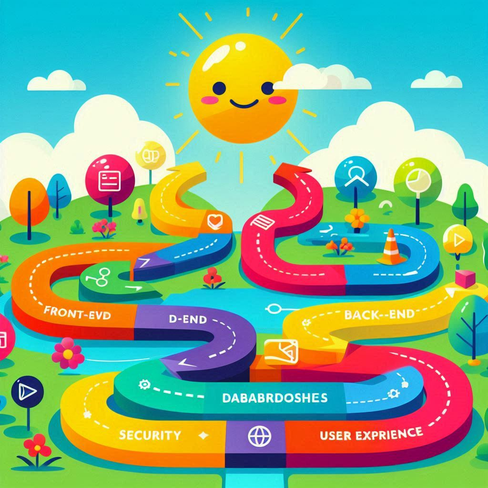

# 60-Days Web Development Roadmap



Welcome to the **60-Days Web Development Roadmap** repository! This repository is designed to guide you through a comprehensive web development journey over the course of 60 days. The roadmap covers foundational concepts, front-end and back-end development, full-stack integration, DevOps, and advanced topics.

## 📚 Roadmap Overview

### 🗓 Days 1-10: Foundations
- **Concepts Covered**: Algorithms & Data Structures, System Design
- **Objective**: Build a strong foundation in fundamental programming and system design concepts.

### 🗓 Days 11-20: Front-End Development
- **Concepts Covered**: HTML, CSS, JavaScript, Advanced JavaScript, React.js
- **Objective**: Learn to create interactive and responsive user interfaces.

### 🗓 Days 21-30: Back-End Development
- **Concepts Covered**: Server-Side Languages, Database Management, API Design
- **Objective**: Develop skills to build and manage the server-side of web applications.

### 🗓 Days 31-40: Full-Stack Development
- **Concepts Covered**: Integration, API Design, Security, Performance
- **Objective**: Combine front-end and back-end skills to create complete web applications.

### 🗓 Days 41-50: DevOps and Deployment
- **Concepts Covered**: Deployment Strategies, Continuous Integration/Continuous Deployment (CI/CD), Containerization, Infrastructure as Code (IaC)
- **Objective**: Learn how to deploy, monitor, and manage web applications effectively.

### 🗓 Days 51-60: Advanced Topics & Final Project
- **Concepts Covered**: Advanced Web Technologies, Project Development
- **Objective**: Explore advanced topics and work on a final project to showcase your skills.

## 📂 Files Included

- **WebDevRoadmap01-10.ipynb** through **WebDevRoadmap51-60.ipynb**: Detailed notebooks covering each topic from the roadmap.
- **interviewQ&A.ipynb**: A collection of tough interview questions and answers related to the topics covered in this roadmap.

## 🛠️ Getting Started

1. Clone this repository:
   ```bash
   git clone https://github.com/goutamhegde002/60-Days-Web-Development-Roadmap.git
    ```
2. Navigate to the directory:
   
   ```bash 
    cd 60-Days-Web-Development-Roadmap
   ```
3. Open the Jupyter notebooks to start learning:

   ```bash
    jupyter notebook WebDevRoadmap01-10.ipynb
   ```

## 🎯 Goals

- Gain comprehensive knowledge of web development.
- Build practical skills in creating and deploying web applications.
- Prepare for technical interviews with a solid understanding of web technologies.

## 📄 License

This repository is licensed under the MIT License. See the [LICENSE](LICENSE) file for more details.

## 📬 Contact

For any questions or feedback, feel free to reach out to me via [LinkedIn](https://linkedin.com/in/m-p-goutam-a9b467202) or [GitHub](https://github.com/goutamhegde002).

---

Happy Coding! 🚀
